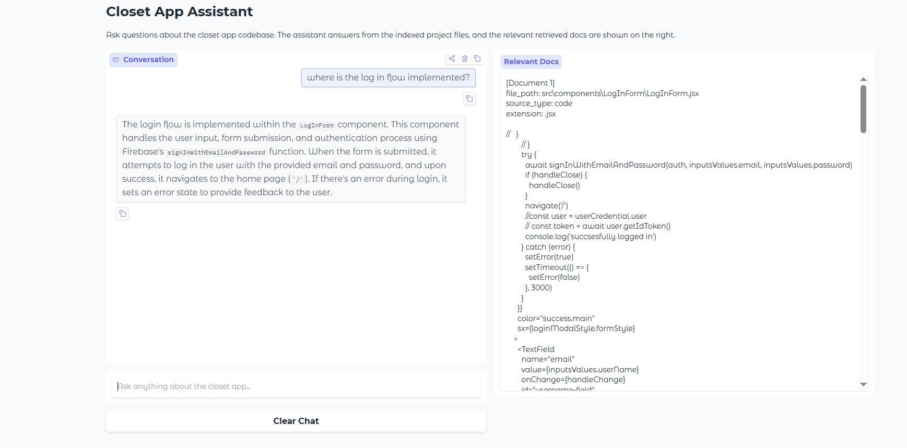

# Codebase RAG Assistant

### Demo

A Retrieval-Augmented Generation (RAG) system that allows users to ask
natural language questions about a codebase.

The assistant retrieves relevant source files from a vector database and
generates grounded answers using an LLM. The UI displays both the
conversation and the retrieved code context used to produce the answer.

This project demonstrates how RAG can be applied to developer
productivity tools, helping engineers understand large unfamiliar
repositories.

---

# Features

- Codebase ingestion pipeline
- Recursive source file loading
- Semantic code retrieval using embeddings
- Chroma vector database
- Retrieval-Augmented Generation with LangChain
- OpenAI embeddings and LLM
- Interactive Gradio UI
- Display of retrieved context documents

---

# Architecture

User Question\
↓\
Vector Search (Chroma + OpenAI Embeddings)\
↓\
Relevant Code Chunks Retrieved\
↓\
LLM (OpenAI)\
↓\
Answer grounded in retrieved context

The UI shows:

- **Left panel:** chatbot conversation\
- **Right panel:** retrieved source files used as context

---

# Project Structure

    codebase-rag/
    │
    ├── app.py
    ├── README.md
    ├── requirements.txt
    ├── .gitignore
    │
    ├── implementation/
    │   ├── ingest.py
    │   └── answear.py
    │
    ├── knowledge-base/
    │   └── custom-closet-app/
    │       ├── src/
    │       ├── public/
    │       └── README.md
    │
    └── vector_db/   (generated after ingestion)

---

# Tech Stack

- Python
- LangChain
- OpenAI API
- ChromaDB
- Gradio
- python-dotenv

---

# Installation

Clone the repository:

    git clone https://github.com/YOUR_USERNAME/codebase-rag.git
    cd codebase-rag

Install dependencies:

    pip install -r requirements.txt

---

# Environment Setup

Create a `.env` file in the root directory:

    OPENAI_API_KEY=your_api_key_here

---

# Ingest the Codebase

Before running the assistant, index the repository:

    python implementation/ingest.py

This step:

- loads source files
- splits them into chunks
- generates embeddings
- stores them in the Chroma vector database

---

# Run the Application

    python app.py

Then open the browser UI.

---

# Example Questions

You can ask things like:

- Where is the authentication logic implemented?
- How does the frontend routing work?
- Which component renders the navigation bar?
- How is the API request logic structured?

The assistant retrieves relevant code and generates an answer grounded
in the indexed repository.

---

# Why This Project

Understanding large codebases is a common challenge for developers.

This project demonstrates how RAG systems can be used to build
AI-powered developer assistants that:

- improve code navigation
- accelerate onboarding
- reduce time spent searching documentation

---

# Future Improvements

Potential extensions include:

- code-aware chunking (functions/classes instead of text blocks)
- repository graph analysis
- streaming responses
- syntax-highlighted code display
- evaluation metrics for retrieval quality

---

# License

MIT License
